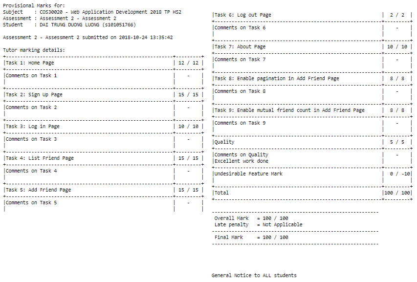

# php-my-friend-system

## Table of Contents

* [Description](#Description)
* [Dependencies](#dependencies)

## Description

This project is My Friend System which is assignment 2 in Web Application Development Unit. This project is created by PHP and MySQL.
I have got 100% marks for this assignment.

### Special features
* Using PHP Data Object (PDO) to access database
* PHP will automatically close the connection when my script ends and Help my code quite clear and easy to read

## Dependencies

The project is cooperated with a JavaScript framework is Bootstrap.
